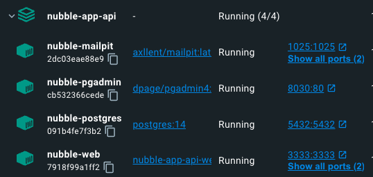

# Configuração de Ambiente

## Instalar o docker

https://www.docker.com/

## Instalar Beekeeper Studio (Community Edition)

https://github.com/beekeeper-studio/beekeeper-studio

## Instalar dependências
```shell script
# Instalar dependências de desenvolvimento
yarn
```

## Iniciar Backend

Todas as etapas para criar o backend estão reunidas em um único comando:

```shell script
# Instalar dependências de desenvolvimento
make docker-install
```

O comando acima é um atalho para realizar as seguintes tarefas:

```shell script
# Command 1: Copy .env.example to .env
cp .env.example .env

# Command 2: Build Docker containers
make docker-build

# Command 3: Run database migrations in Docker
make migration-docker

# Command 4: Reset Database and run seeds
make reset-docker

# Command 5: Install project dependencies with Yarn
yarn

# Command 6: Generate Swagger documentation
make generate-docs
```

Abra o Docker Dashboard para verificar se todos os containers foram criados.


---

### 2. Conectar Banco de dados

Chegou a hora de conectar o banco de dados. Abra o Beekeeper Studio e crie uma nova conexão.

- Selecione Postgres
- Mantenha Host (localhost) e Port padrão (5432)
- Credenciais
     Campo | Valor
    --- | ---
    User | nubble
    Password | nubble
    Default Database | nubble_db_development
- Dê um nove para a conexão. Ex "Nubble" e pressione "Save".


### 3. Criar o Bucket no Minio

- Acesse o Minio ma porta [http://localhost:8900](http://localhost:8900)
    - username: `nubble`
    - password: `nubble-pass`
- 

- Clique em **Create a Bucket**, em Bucket Name informe: **nubble**
- Após criar o Bucket altere o **Access Policy** para **Public**
- Em **Access Keys** clique em **Create Access Key**
- Copie suas chaves para o arquivo **.env**
    - `S3_KEY='Access Key`
    - `S3_SECRET='Secret Key`
- ative o túnel HTTPS com o ngrok usando o seu **Static domain**
    - ` ngrok http --domain=hugely-usable-swan.ngrok-free.app http://localhost:9000`
- Substitua no arquivo `.env` o valor da `S3_CDN_URL` de `http://localhost:9000` pela sua nova URL. Por exemplo: ` https://hugely-usable-swan.ngrok-free.app`
- rode o comando `make docker-rebuild` para subir a atualização do S3

---


## Importar Endpoits da API para o [Insomnia][l-Insomnia]
[![Importar Insomnia}][i-Insomnia-Run]][l-Insomnia-Import]

---

**Pronto! A Nubble API está pronta para ser utilizada! 🥳**

Aplicações | URL | User | Password
--- | --- | --- | ---
App - NodeJs | <http://localhost:3333> | - | -
Documentação - Swagger | <http://localhost:3333/docs> | - | -
Postgres - pgAdmin | <http://localhost:8030> | admin@admin.com | admin
E-mail - Mailpit | <http://localhost:8040> | - | -
Minio - S3 | <http://localhost:8900> | nubble | nubble-pass

---

### Tecnologias Utilizada

- [Docker][l-docker]
- [NodeJs v18.17.0][l-nodejs]
- [Adonis v5][l-adonis]
- [Postgres v14][l-postgres]
- [pgAdmin][l-pgadmin]
- [Mailtip][l-mailpit]
- [Minio][l-minio]
- [Adonis Auto Swagger][l-swagger]

[l-docker]: https://www.docker.com
[l-nodejs]: https://nodejs.org
[l-adonis]: https://adonisjs.com
[l-postgres]: https://hub.docker.com/_/postgres
[l-pgadmin]: https://www.pgadmin.org
[l-mailpit]: https://github.com/axllent/mailpit
[l-minio]: https://min.io
[l-swagger]: https://github.com/ad-on-is/adonis-autoswagger
[l-Insomnia]: https://insomnia.rest/download
[l-Insomnia-Import]: https://insomnia.rest/run/?label=Nubble%20API&uri=https://github.com/LucasGarcez/nubble-app-api/blob/f0594a698a7ff00ed96b06acd10da2f75712b5d7/docs/files/Insomnia.json

[i-Insomnia-Run]: https://insomnia.rest/images/run.svg "Importar Insomnia"
